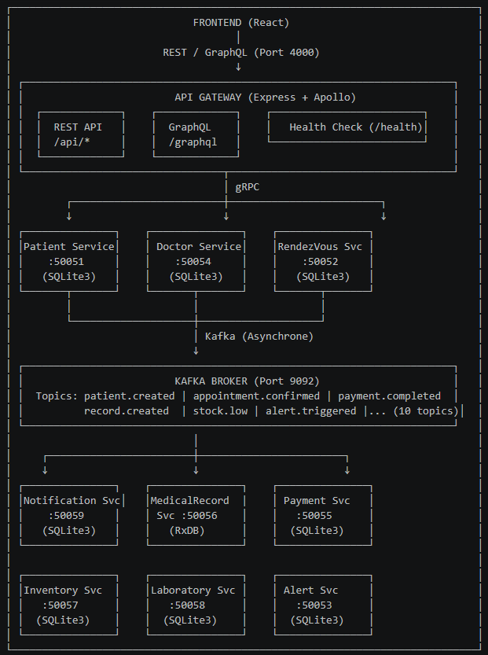
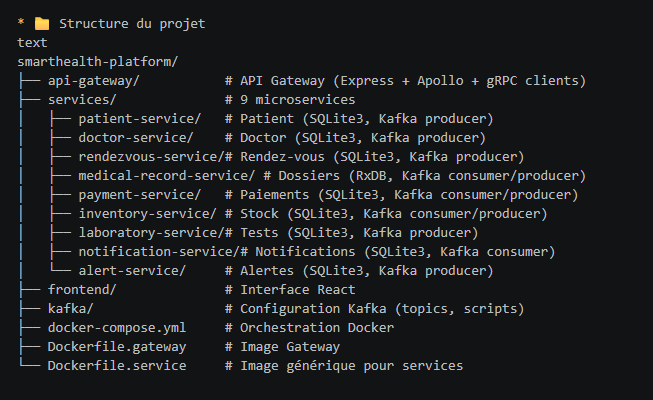

                                                          SMARTHEALTH PLATFORM - README
                                        Plateforme de gestion santé basée sur une architecture microservices

* 🚀 Technologies utilisées

Composant      :	Technologies
API Gateway	   : Node.js, Express, Apollo Server (GraphQL), gRPC
Microservices  :Node.js, gRPC, KafkaJS
Message Broker :	Apache Kafka (mode KRaft)
Bases de données :  	SQLite3 (services transactionnels), RxDB (dossiers médicaux)
Frontend    :	React, Tailwind CSS, Apollo Client
Conteneurisation :	Docker, Docker Compose
Monitoring :	Kafka UI (optionnel)

* 📦 Services déployés
Service         	   Port gRPC	Base de données      	Rôle
patient-service 	   50051	SQLite3	                    Gestion des patients
doctor-service	       50054	SQLite3	                    Gestion des médecins
rendezvous-service	   50052	SQLite3	                    Gestion des rendez-vous
medical-record-service 50056	RxDB	                    Dossiers médicaux
payment-service        50055	SQLite3                 	Factures et paiements
inventory-service	   50057	SQLite3	                    Gestion des médicaments
laboratory-service	   50058	SQLite3	                    Tests de laboratoire
notification-service   50059	SQLite3                  	Emails/SMS/Push
alert-service	       50053	SQLite3                 	Alertes médicales

* 🔗 Communication

Type	               Protocole	        Utilisation
Client → Gateway	   REST + GraphQL	    Interface utilisateur
Gateway → Services	   gRPC (Protobuf)	    Communication synchrone
Services ↔ Services	   Kafka	            Événements asynchrones

* Topics Kafka (10 topics métier)
patient.created | doctor.created | appointment.confirmed | payment.completed | invoice.generated | record.created | prescription.added | stock.low | test.result.ready | alert.triggered

⚡ Installation et exécution
Prérequis
* Docker Desktop 20.10+

* Node.js 20+ (optionnel, pour développement local)

* Lancement avec Docker (recommandé)
bash
# Cloner le projet
git clone <repository-url>
cd smarthealth-platform

# Démarrer tous les services
docker-compose up -d

# (Optionnel) Lancer l'interface de monitoring Kafka
docker-compose --profile monitoring up -d

* Accès

*API Gateway : http://localhost:4000

*GraphQL Playground : http://localhost:4000/graphql

*Health Check : http://localhost:4000/health

*Kafka UI : http://localhost:8080 (avec profile monitoring)

* Tests des endpoints

# Créer un patient (REST)
curl -X POST http://localhost:4000/api/patients \
  -H "Content-Type: application/json" \
  -d '{"name":"Jean Dupont","email":"jean@email.com","phone":"0612345678"}'

# Tester la connexion gRPC
node api-gateway/test-grpc.js

* 👥 Équipe
Projet réalisé par Yassine, Baha, Ahmed (Binôme/Trinôme)

Suivi GitHub : Commits réguliers, branches, répartition équilibrée des tâches.